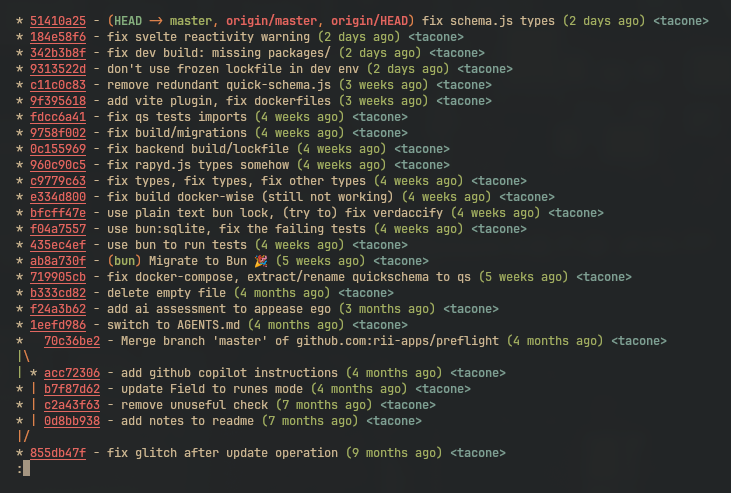

# Dotfiles Central

These are my personal dotfiles, which I am sharing in the hope people might find
here and there some interesting trick that can be useful for them.

> You are welcome to steal anything to make your own. Use issues to contact me
> and chat.

See the getting started section below to install and use these dotfiles.

We are using some Oh-My-Zsh plugins without loading the full oh-my-zsh
framework.

## Target system

These dotfiles are designed to work with a vanilla Omarchy Linux installation
(that is: Arch Linux + Hyprland + some defaults). You might need to adjust
things to make them work on your system.

**A note of warning**: these dotfiles also contain my personal Hyprland
configuration files, so check them carefully before applying them to your
system.

## Installation script

The [.install.sh](.install.sh) script is a idempotent installer that sets up the
dotfiles and installs the needed packages and Oh-My-Zsh plugins. It assumes you
are on an Arch Linux.

## Keyd 😎

[Keyd](https://github.com/rvaiya/keyd) is installed by
[.install.sh](.install.sh) and the configuration file is symlinked to
`/etc/keyd/default.conf`. It remaps the keyboard at system level, so the
keybindings work everywhere, regardless of window manager, application or
terminal emulator.

It's a very powerful tool, which I wholeheartedly recommend. Check its
documentation for more information.

In these dotfiles, keyd is used to provide some global keybindings enabling
**videogame-like navigation across all applications** when certain keys are
combined with CapsLock.

- **CapsLock + w / a / s / d** will work as arrow keys.
- **CapsLock + i / j / k / l** will work as arrow keys too.

In the same vein, keybindings for Home/End, PageUp/PageDown, Backspace, Delete,
Escape and Return are provided.

Once you get used to it, it's incredibly handy and efficient.

## Oh-My-Zsh plugins

We install and import the following useful plugins:

| Plugin Name             | Description                                                                          |
| ----------------------- | ------------------------------------------------------------------------------------ |
| colored-man-pages       | syntax highlighting for man pages                                                    |
| command-not-found       | if the command you type is not found, the system will prompt you to install it (y/n) |
| git                     | useful aliases                                                                       |
| httpie                  | a handy CLI http client                                                              |
| grc                     | syntax highlighting for the output of common CLI commands                            |
| magic-enter             | press enter inside a folder to list files or run git status                          |
| nmap                    | nmap aliases                                                                         |
| zsh-syntax-highlighting | syntax highlighting as you type in the shell                                         |

## Where to look

The `.zsh.d/` directory contains modular configuration scripts loaded in
sequence. Here are some of the most interesting tricks in each file:

| File                                              | Features                                                                                                                                                                                                               |
| ------------------------------------------------- | ---------------------------------------------------------------------------------------------------------------------------------------------------------------------------------------------------------------------- |
| [00-init.zsh](.zsh.d/00-init.zsh)                 | Loads oh-my-zsh plugins (git, extract, zsh-syntax-highlighting) without loading the full oh-my-zsh framework                                                                                                           |
| [10-environment.zsh](.zsh.d/10-environment.zsh)   | Environment configuration                                                                                                                                                                                              |
| [20-aliases.zsh](.zsh.d/20-aliases.zsh)           | `eza` with icons and hyperlinks, `parent-find` to search by filename upwards in the directory tree, `before` and `after` to output lines before a regex pattern                                                        |
| [30-functions.zsh](.zsh.d/30-functions.zsh)       | `col1`-`col9` functions to extract columns from output, `find-port` and `kill-port` to manage processes by port number, `gitignore.io` to generate .gitignore files, `filewatch` to execute commands when files change |
| [40-docker.zsh](.zsh.d/40-docker.zsh)             | Useful docker aliases for basic maintenance                                                                                                                                                                            |
| [50-git.zsh](.zsh.d/50-git.zsh)                   | Git aliases (also importing the oh-my-zsh git plugin for more advanced features)                                                                                                                                       |
| [55-zoxide.zsh](.zsh.d/55-zoxide.zsh)             | Smart directory jumping with learning (auto-generated initialization)                                                                                                                                                  |
| [60-completions.zsh](.zsh.d/60-completions.zsh)   | Enhanced kill command completion with process details, arrow-key navigable menus                                                                                                                                       |
| [70-keybindings.zsh](.zsh.d/70-keybindings.zsh)   | Alt+k to list all available keybindings, Alt+l for git log, Alt+g to pipe to grep, Alt+x for xargs, Alt+Shift+S to insert sudo                                                                                         |
| [80-integrations.zsh](.zsh.d/80-integrations.zsh) | Starship prompt, fzf fuzzy finder, grc output highlighting, thefuck command correction                                                                                                                                 |
| [90-custom.zsh](.zsh.d/90-custom.zsh)             | Long-running command notifications (desktop + terminal), execution time display for commands over 10 seconds                                                                                                           |
| [99-startup.zsh](.zsh.d/99-startup.zsh)           | Matrix rain on terminal startup with random colors and fortune messages (needs `neo-matrix` and `fortune` installed)                                                                                                   |

## Keybindings

Several keybindings are provided, to make you way faster, from git log, to fast
command piping, to folder navigation.

> Press Alt+k in the terminal to show the available keybindings.

A few examples:

- Press Alt+L to run `git log`
- Press Alt+G to add '| grep ' just like you typed it
- Press Alt+X to add '| xargs '
- Press Alt+Shift+S to insert 'sudo ' at the beginning of the command line
- Press Alt+W to insert `watch` at the beginning of the command line
- Press Ctrl+Z not only to suspend the current process, but also to bring it
  back (like `fg`)
- Press Alt+T to insert the current timestamp

## Enhanced Git

First off, we are importing the oh-my-zsh git plugin (so you get the very same
aliases).

In the CLI:

- Press Enter to run git status in any git repository (with clickable links to
  the online branch on GitHub/GitLab/Azure)
- Press Alt+L to run git log (Alt+Shift+L for git log --all), with clickable
  commit links
- Press Alt+D to run git diff, with clickable commit links (Alt+Shift+D for git
  diff --cached)
- Press Alt+O to write "git checkout" on the current command line



We import the oh-my-zsh git plugin (so you get the very same aliases).

## Zoxide

You can use fuzzy seach zoxinde using Alt+z or use it as usual, for example:

```bash
z foo        # jump to the most relevant directory matching "foo"
```

## Getting started

Clone the repository, then install the dotfile using
[rcm](https://thoughtbot.github.io/rcm/), run:

```bash
rcup -v
```

There's also an installer scripts that installs the needed packages, zsh
plugins, and sets up a few symlinks (just the keyd configuration file for now).

```bash
cd ~/.dotfiles
./.install.sh
```

Post-install: follow the script's final notes (source zsh config,
`chsh -s $(which zsh)`, log out/in for group changes).

## Status

Roadmap:

- [x] Migrate remaining oh-my-zsh plugins and behaviours to custom scripts
- [x] Hyprland: disable focus follows mouse
- [x] Add more files to versioning (the Omarchy user defined files: hyprland
      config, ...).
- [x] Change Hyprland keybindings to match the previous dotfiles (mostly
      vim-like navigation).
- [x] Change Hyprland keybindings - Part 2 (resizing, killing, closing)
- [x] Add battery indicator to Waybar
- [ ] Add low battery notification
- [ ] Fix Alt+c conflict (wc -l and fzf cd)
- [x] Configure ghostty keybindings
- [ ] Configure kitty keybindings
- [x] Figure out a way to get a reboot/logout menu (Omarchy style).
- [ ] Investigate Dank Linux <https://danklinux.com/>
- [ ] Super + Ctrl + X to kill a window
- [ ] Add sudo shortcut to neovim
